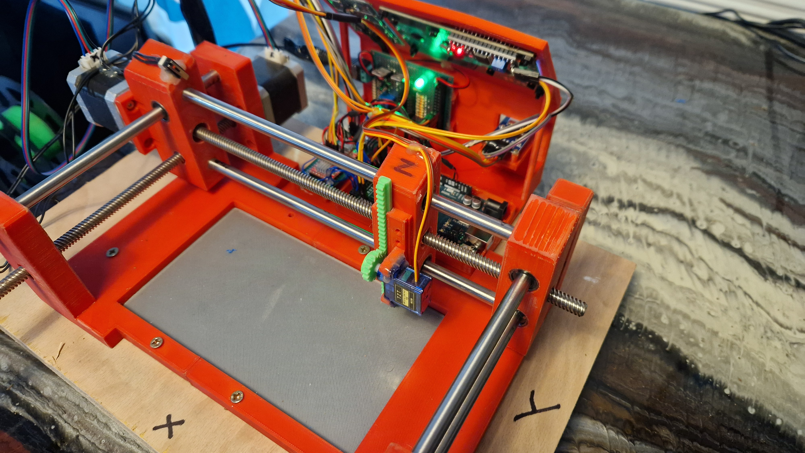
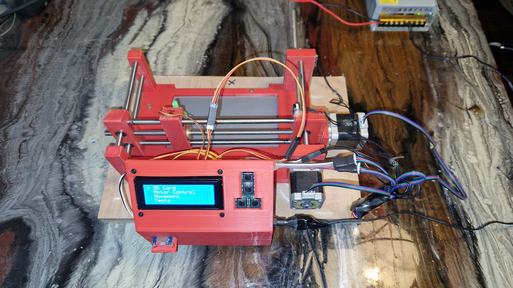

# ArduPlot3D

Create run commands for a robotic arm.
Design movements for a finger to press a phone screen.

Current Address [Live Link](https://arduplot3d.netlify.app/)

## Table of contents

- [ArduPlot3D](#arduplot3d)
  - [Table of contents](#table-of-contents)
  - [General info](#general-info)
  - [Features](#features)
  - [Technologies](#technologies)
  - [Run This Project Locally](#run-this-project-locally)
  - [Run this project locally](#run-this-project-locally-1)
  - [Testing](#testing)

## General info

ArduPlot3D is an innovative web application designed to control a robot arm using a variety of movement types including tap, move, move and tap, drag, and pause. The application allows users to design movements for a finger to press a phone screen directly on a canvas, store and save projects, and play simulations based on the created data points. Projects can be downloaded and saved as GPGL files. We are currently developing a WiFi connection feature to enhance functionality.

Using canvas we can plot the points that a user makes on the screen.
These points can always be manipulated later.
The points can be saved to a users database.

## Features

- **Design on Canvas**: Plot and manipulate points on a screen to control a robot arm.
- **Save and Load Projects**: Save projects to a database and load them when needed.
- **Simulation**: Play a simulation based on the designed movements.
- **Export**: Download projects as GPGL files.
- **WiFi Connection**: (In development) Connect the robot arm via WiFi for seamless control.

## Technologies

**Frontend**:

- React
- JavaScript
- Tailwind CSS
- Axios
- Validator

**Backend**:

- Express
- Prisma
- JavaScript

## Run This Project Locally

## Run this project locally

1. Fork this repository and clone the fork to your machine.
2. Navigate to client and server files and run
3. `npm install`
4. `npm start`

## Testing

API tests run through Insomnia testing suit.
Check server dir for test files.
