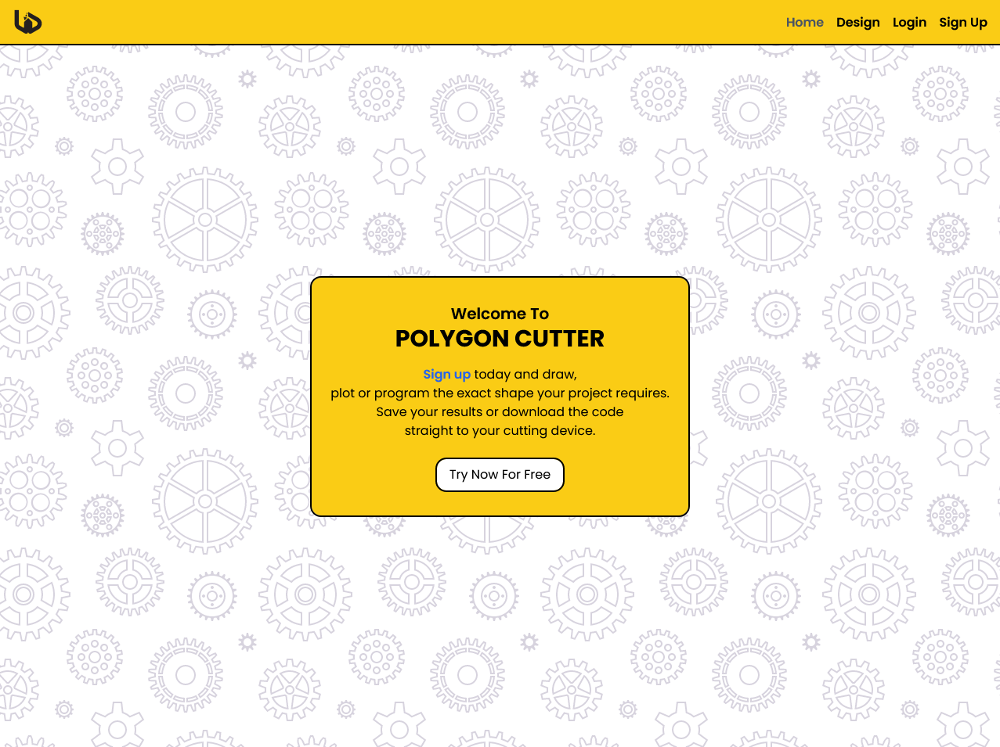

# Polygon-fullstack

Create shapes and save to a database

Project name: Polygon Cutter

Current Address [Live Polygon Cutter Link](https://main--velvety-blini-fa7e84.netlify.app/)

## Table of contents

- [Polygon-fullstack](#polygon-fullstack)
  - [Table of contents](#table-of-contents)
  - [General info](#general-info)
  - [Technologies](#technologies)
  - [Run this project locally](#run-this-project-locally)
  - [Testing](#testing)

## General info

Using canvas and useRed we can plot the points that a user makes one the screen.
These points can always be manipulated later.
The points can be saved to a users database.

Server deployment with Vercel @ [https://polygon-fullstack.vercel.app/](https://polygon-fullstack.vercel.app/)

## Technologies

App developed with:

Frontend: React, JavaScript, Tailwind, Axios, validator

Backend: Express, Prisma, JavaScript

## Run this project locally

1. Fork this repository and clone the fork to your machine.
2. Navigate to client and server files and run
3. `npm install`
4. `npm start`

## Testing

API tests run through Insomnia testing suit.
Check server dir for test files.

http://localhost:4000/users/all-users
http://localhost:4000/users/post-score
{
	"username": "newmae",
	"score": 121
}